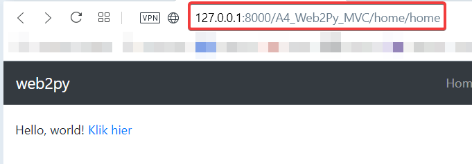
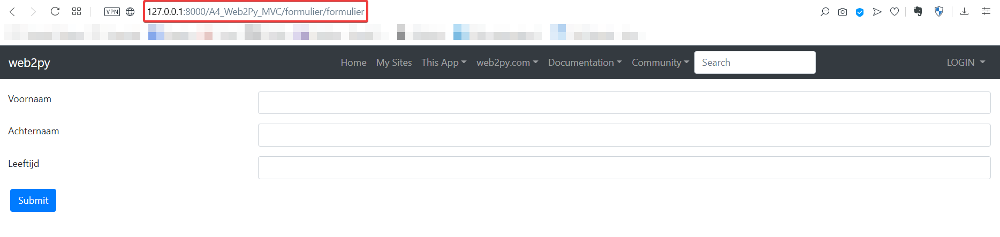
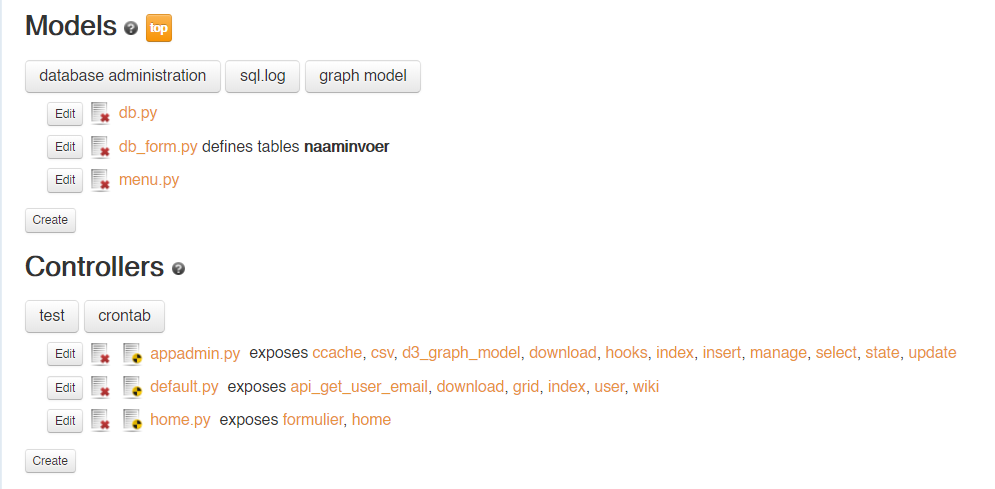
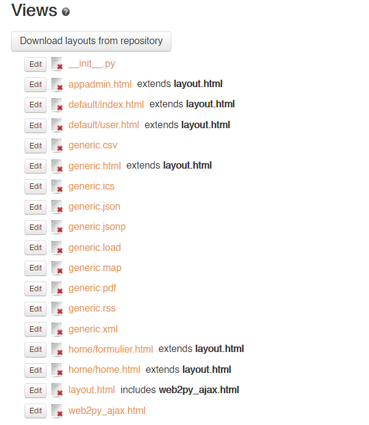

# A4_Web2Py_MVC
als vervanging voor A4-PHP

Ten eerste even een beetje basisuitleg van Web2Py. De zogenoemde routes die worden gemaakt in php, 
worden in Web2Py aan de hand van functies automatisch gemaakt. Dus je maakt een functie aan in de controller.py en Web2Py maakt daarvoor automatisch een route aan.

Stel je het volgende voor: Je maakt een functie index in de controller "default.py". 
Dan maakt Web2Py automatisch een route aan zodat je via internet op deze manier die index functie kunt bezoeken:
http://127.0.0.1/default/index, hierbij is default de controller en index de functie in die controller.

De relevante punten van de Eindopdracht aan de hand van Web2Py:

1. In controllers/home.py staat de functie home die de variabele msg meegeeft aan de view in views/home/home.html
Deze wordt dan weergegeven in de view. Zie als voorbeeld:

Als je naar de adresbalk kijkt zie je nogmaals welke route op dat moment gebruikt wordt.

2. In controllers/formulier.py staat de functie formulier die de variabele form (wat een formulier is op basis van de tabel in models/db_form.py).
Deze form wordt dan weergegeven in de view in views/formulier/formulier.html, zie als voorbeeld:

3. Het model wat wij hebben aangemaakt voor het formulier staat in models/db_form.py, dit is een tabel genaamd "naaminvoer", met als velden: "voor- en achternaam" en "leeftijd".

4. De link in deze screenshot gaat naar http://127.0.0.1/formulier/formulier, dus de formulier functie in de formulier controller.

5. Overview MVC admin interface Web2Py

